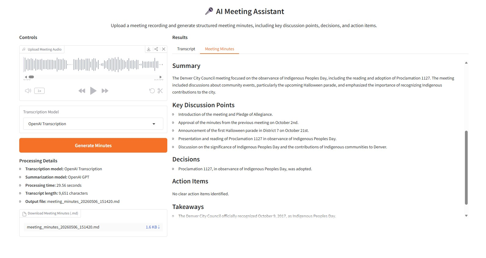

# 🎤 AI Meeting Assistant

AI Meeting Assistant is an end-to-end AI application that converts meeting audio into structured meeting minutes.
The app supports audio transcription, meeting summarization, action-item extraction, transcript viewing, processing details, and Markdown export.

This project was built as a practical AI Engineering portfolio project to demonstrate the design of a modular AI pipeline using both closed-source and open-source model options.

---

## 📸 Screenshots

### Application UI



---

## 🚀 Features

* Upload meeting audio files
* Transcribe audio using:

  * OpenAI transcription API
  * HuggingFace Whisper
* Generate structured meeting minutes using:

  * OpenAI GPT
  * Local Qwen 2.5 (3B) via Ollama  
* View the full transcript
* View professional meeting minutes
* Extract:

  * Meeting overview
  * Summary
  * Key discussion points
  * Decisions
  * Action items
  * Takeaways
* Download generated meeting minutes as a Markdown file
* Display processing details:

  * transcription model used
  * summarization model used
  * processing time
  * transcript length
  * output filename
* Interactive Gradio user interface
* Safe temporary file handling (no audio stored permanently) 

---

## 🧠 Project Goal

The goal of this project is to build a practical AI assistant that can help users convert meeting recordings into useful written documentation.

The project demonstrates:

* speech-to-text processing
* large language model summarization
* prompt engineering
* modular AI pipeline design
* open-source vs closed-source model trade-offs
* user-facing AI application development
* Markdown output generation

---

## 🏗️ Architecture

```text
Audio Upload
    ↓
Transcription
    ├── OpenAI Transcription
    └── HuggingFace Whisper
    ↓
Transcript
    ↓
Meeting Minutes Generation
    ├── OpenAI GPT
    └── Local Qwen (Ollama)  
    ↓
Results
    ├── Transcript tab
    ├── Meeting Minutes tab
    ├── Processing Details
    └── Markdown Download
```

---

## 📁 Project Structure

```text
ai-meeting-assistant/
│
├── app/
│   ├── __init__.py
│   ├── pipeline.py
│   ├── transcription.py
│   └── summarizer.py
│
├── ui/
│   ├── __init__.py
│   └── gradio_app.py
│
├── outputs/
│   └── generated meeting minutes files
│
├── temp_audio/   <-- temporary files (auto-deleted)  
│
├── .env
├── .gitignore
├── requirements.txt
└── README.md
```

---

## 🧩 Main Components

### 1. Transcription Module

Located in:

```text
app/transcription.py
```

This module handles audio-to-text conversion.

It currently supports:

#### OpenAI Transcription

Uses:

```text
gpt-4o-mini-transcribe
```

This option is fast and suitable for longer audio files.

#### HuggingFace Whisper

Uses:

```text
openai/whisper-base
```

This provides a free/open-source transcription option.

Note: HuggingFace Whisper runs locally and can be slow on CPU for long audio files.

---

### 2. Summarization Module

Located in:

```text
app/summarizer.py
```

This module converts transcripts into structured meeting minutes.

It supports:

#### OpenAI GPT

```text
gpt-4o-mini
```

High-quality and fast cloud-based summarization.

#### Local Qwen (NEW)

```text
qwen2.5:3b (via Ollama)
```

* Runs locally
* No API cost
* Slightly slower on CPU
* Includes automatic fallback to OpenAI if it fails

---

### 3. Pipeline Module

Located in:

```text
app/pipeline.py
```

This module connects transcription and summarization into one workflow:

```text
Audio file → Transcript → Meeting minutes
```

Includes:

* Model switching (OpenAI / Whisper / Qwen)
* Fallback handling (Ollama → OpenAI) 

---

### 4. Gradio UI

Located in:

```text
ui/gradio_app.py
```

The Gradio interface allows users to:

* upload audio
* choose the transcription model
* choose the summarization model 
* generate meeting minutes
* view transcript
* view meeting minutes
* download Markdown output
* check processing details

---

## ⚙️ Installation

### 1. Clone the repository

```bash
git clone https://github.com/your-username/ai-meeting-assistant.git
cd ai-meeting-assistant
```

### 2. Create a virtual environment

```bash
python -m venv .venv
```

Activate it:

#### Windows PowerShell

```bash
.venv\Scripts\Activate
```

#### macOS/Linux

```bash
source .venv/bin/activate
```

### 3. Install dependencies

```bash
pip install -r requirements.txt
```

---

## 🔐 Environment Variables

Create a `.env` file in the project root:

```env
OPENAI_API_KEY=your_openai_api_key_here
```

Do not commit your real `.env` file to GitHub.

---

## 🎵 FFmpeg Requirement

HuggingFace Whisper requires FFmpeg to process audio files.

---

## 🧠 Ollama Requirement (NEW)

To use the local Qwen model:

1. Install Ollama:

```bash
https://ollama.com
```

2. Pull the model:

```bash
ollama pull qwen2.5:3b
```

3. Run Ollama:

```bash
ollama run qwen2.5:3b
```

---

## ▶️ Running the App

```bash
python -m ui.gradio_app
```

---

## 🧪 How to Use

1. Upload a meeting audio file.
2. Choose transcription model.
3. Choose summarization model (OpenAI or Local Qwen). 
4. Click **Generate Minutes**.
5. View results.
6. Download markdown file.

---

## 📊 Model Options and Trade-offs

| Component     | Model       | Type  | Notes        |
| ------------- | ----------- | ----- | ------------ |
| Transcription | OpenAI      | API   | Fast         |
| Transcription | Whisper     | Local | Free         |
| Summarization | OpenAI GPT  | API   | High quality |
| Summarization | Qwen 2.5 3B | Local | Free         |

---

## ⚠️ Current Limitations

* HuggingFace Whisper can be slow for long audio files when running on CPU.
* Local models may be slower than OpenAI.
* Very long transcripts are truncated.

---

## 🔮 Future Improvements

* Add speaker diarization
* Add transcript chunking
* Add Docker support
* Add cloud deployment

---

## 🧠 What I Learned

* Hybrid AI systems (local + cloud)
* Model fallback strategies
* File handling and robustness
* Real-world AI pipeline design

---

## 👤 Author

Developed by Seyyednavid Hejazijouybari as an AI Engineering portfolio project.
